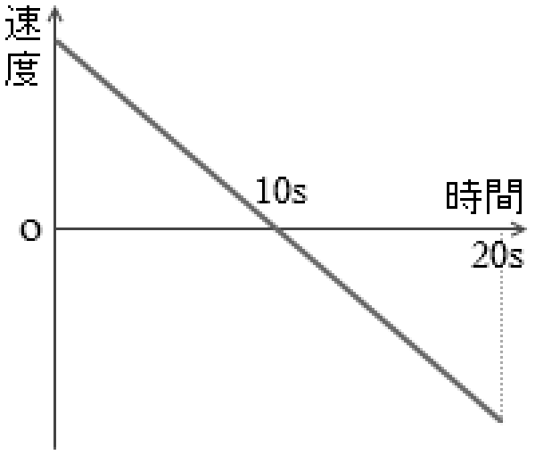

## ビジネスプラン発表 **7分**

- 植田達郎
- フリーランスプログラマ
- 四日市

---
## 流れ

1. どういうアプリか **4分**
2. ビジネスプラン **3分**

---
## 1. どういうアプリか **4分**

---
## ◎こんなグラフ、高校で見ませんでしたか？ **1分**

---
## ◎画像処理でできること **1分**

- [画像処理](https://www.youtube.com/embed/WhXlPwN5CkU)
- 実際にはDEMO

---
## ◎物体の速度を可視化する **1分**

2. [速度ベクトル](https://www.youtube.com/watch?v=a5POcgc4PM4)

3. [速度のグラフ化](https://www.youtube.com/watch?v=HeJrlidMklY)

---
## ◎見覚えのあるグラフが？ **1分**

- [斜面を登る運動](https://www.youtube.com/embed/WhXlPwN5CkU)

---
## ◎デモの反応 **15秒**

- 「**これはいいねえ**」（愛知県の物理教員のボス的な方）
- 「**準備がラク**なのが良い」（三重県の物理教員）
- 「早く**Windows**で使えるようにしてくれ」（愛知県の物理教員）
- 「こういうアプリは**今後トレンドになる**のではないか」（宮城県の物理教育に携わっている物理博士）

---
## 2. ビジネスプラン **3分**

---
## ◎製品で解決したい課題 **30秒**

- 高校物理の学習者の多くが途中で**あきらめてしまう**
- 高校物理では**目に見えない**事象（加速度、力など）を理解しなければならない
- 実験をする**時間がない**（授業時間が足りない＋教員の準備が大変）

---
## ◎製品内容 **30秒**

- 物理教育を補助するアプリ

## ◎製品のウリ

- 10年間の物理教員の**経験**
- 現場の教員の忙しさを踏まえた、**手軽に実験ができる**アプリ

## ◎製品のもっとも優れた点

- **画像処理**を使って、速度や加速度、力などを可視化する

---
## ◎顧客の導線 **15秒**

- **学会**での発表（日本物理学会、日本物理教育学会）
- 物理教員の**勉強会**に参加して発表（愛知、三重は参加済み）
- **書籍**の執筆
- 公立学校からの**口コミ**（後述）

---
## ◎収益の仕組み **30秒**

- アプリを起動すると**「公立学校用」**と表示される
- これを解除するには**有償**とする
- **公立学校**で評判を広め、**私立学校・塾**から収入を得る

## ◎収益の背景

- 公立学校では教材を**買えない**（実情はポケットマネー）
- 私立学校・塾では簡単に予算で**買うことができる**

---
## ◎収益の見込み（国内） **30秒**

[^1]: 学校基本統計
[^2]: 経済産業省、特定サービス産業動態統計調査
[^3]: 教員勤務実態調査：理科10.2%。以下、物理教員は全体の3%として算出。
[^4]: 高校教員数は公立：25万人、私立：5万人、塾：8万人

- 物理教員の数　公立8000人、私立＋塾**5000人**
- Windows版（教員用：単価**1万円**）
  - 私立・塾の**1/20**が購入→**250万円**
- iPad版（生徒用：単価**1000円**）
  - 私立・塾の**1/40**が購入→**500万円**
- 出張使い方講習の実施（単価**5万円**）50回→**250万円**

---
## ◎収益の見込み（海外） **30秒**

[^5]: 世界の中学・高校の教員数は1000万人

- 物理の教員は**10万人**
  - Windows版を教員の**1/50**が購入→**2000万円**
  - iPad版を教員の**1/100**が購入→**4000万円**

## 結論

- **国内**の市場は小さい
- **海外**の国際科学教育学会などで発表していく

以上